# Troubleshooting / Dépannage

Ce document répertorie les erreurs et problèmes courants rencontrés lors du développement ou de l’utilisation du projet Expo-SAT, ainsi que les solutions et bonnes pratiques pour les résoudre efficacement. Il vise à faciliter le diagnostic et le dépannage, que ce soit pour des soucis de configuration, d’environnement, de dépendances ou d’utilisation des outils associés au projet.
<br><br>

## Table des matières

- [Erreur "Internal Server Error" (Erreur 500)](#erreur-internal-server-error-erreur-500)
- [Erreur "La communication avec le serveur a échoué"](#erreur-la-communication-avec-le-serveur-a-échoué)
- [Erreur "Missing environment variable"](#erreur-missing-environment-variable)
- [Erreur "La communication avec le serveur a échoué" : net::ERR_CERT_AUTHORITY_INVALID](#erreur-la-communication-avec-le-serveur-a-échoué--neterr_cert_authority_invalid)
- [Erreur "La communication avec le serveur a échoué" : CORS, ERR_FAILED](#erreur-la-communication-avec-le-serveur-a-échoué--cors-err_failed)
- [Erreur "La communication avec le serveur a échoué" : CORS](#erreur-la-communication-avec-le-serveur-a-échoué--cors)
- [Erreur "La communication avec le serveur a échoué" : pas de log](#erreur-la-communication-avec-le-serveur-a-échoué--pas-de-log)
- [Erreur "Votre connexion n'est pas privée / Erreur de confidentialité"](#erreur-votre-connexion-nest-pas-privée--erreur-de-confidentialité)
- [Erreur "npm run start: Missing script "start""](#erreur-npm-run-start-missing-script-start)
- [Erreur "npm install n'installe pas mes librairies"](#erreur-npm-install-ninstalle-pas-mes-librairies)
- [Erreur "'tsc' n'est pas reconnu en tant que commande interne"](#erreur-tsc-nest-pas-reconnu-en-tant-que-commande-interne)
- [Erreur "erreurs avec les librairies" (npm, dépendances, build, etc.)](#erreur-erreurs-avec-les-librairies-npm-dépendances-build-etc)
- [Problèmes avec AMPPS](#problèmes-avec-ampps)
- [Problème : Suppression impossible (équipes, juges, modèles de grille d’évaluation)](#problème--suppression-impossible-équipes-juges-modèles-de-grille-dévaluation)
- [Problème : Impossible de créer un VirtualHost (AMPPS)](#problème--impossible-de-créer-un-virtualhost-ampps)
- [Où trouver les logs d’erreurs PHP et Apache ?](#où-trouver-les-logs-derreurs-php-et-apache)
<br><br>

---

## Erreur "Internal Server Error" (Erreur 500)

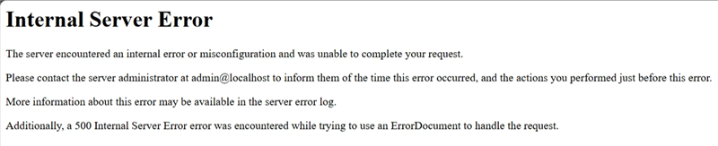

Cette erreur apparaît généralement lorsque le dossier `build` est absent ou incomplet à la racine du projet. AMPPS ne parvient alors pas à localiser les fichiers nécessaires au bon fonctionnement du site compilé.
<br><br>

**Solution :**
Assurez-vous d’avoir généré le dossier `build` en exécutant le script de compilation. Pour cela, ouvrez un terminal à la racine du projet et lancez la commande suivante :

```powershell
.\build.ps1
```

> **Remarque Mac/Linux :**  
> Si vous êtes sur Mac ou Linux, utilisez le script suivant à la place :
> ```bash
> ./build.sh
> ```
<br><br>

---

## Erreur "La communication avec le serveur a échoué"

Cette erreur indique que le frontend ne parvient pas à communiquer avec le serveur backend. Plusieurs causes possibles :

- **La base de données `exposat` n’a pas été créée.**
- **Les fichiers de variables d’environnement `.env` et `.env.prod` sont absents ou incomplets.**
- **AMPPS n’est pas démarré, ou les services Apache/MySQL ne sont pas actifs.**
<br><br>

**Solution :**
1. Vérifiez que la base de données `exposat` existe bien dans votre environnement MySQL.
2. Assurez-vous que les fichiers `.env` et `.env.prod` sont présents et correctement configurés.
3. Démarrez AMPPS et vérifiez que les services Apache et MySQL sont en fonctionnement.
<br><br>

---

## Erreur "Missing environment variable"

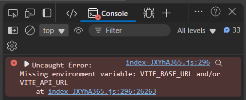

Cette erreur apparaît lorsque certaines variables d’environnement essentielles, comme `VITE_BASE_URL` ou `VITE_API_URL`, ne sont pas définies. Cela se produit généralement si les fichiers `.env` et/ou `.env.prod` sont absents ou incomplets dans le dossier du frontend.
<br><br>

**Solution :**
- Vérifiez que les fichiers `.env` et `.env.prod` existent bien dans le dossier `front` du projet.
- Assurez-vous que ces fichiers contiennent toutes les variables nécessaires, notamment `VITE_BASE_URL` et `VITE_API_URL`.
- Si besoin, copiez un exemple de fichier `.env` fourni dans le projet et adaptez-le à votre configuration.

Après avoir corrigé ou ajouté les fichiers de variables d’environnement, relancez la compilation du projet puis rechargez la page pour vérifier que l’erreur a disparu.
<br><br>

---

## Erreur "La communication avec le serveur a échoué" : net::ERR_CERT_AUTHORITY_INVALID

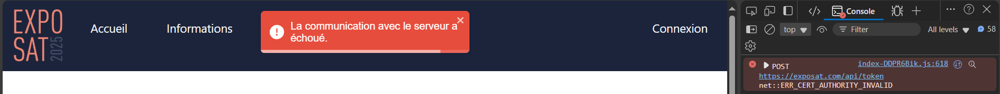

Cette erreur apparaît lorsque le frontend tente d’accéder à l’API via une URL commençant par `https://`, alors que le serveur local n’est pas configuré pour le HTTPS. Cela se produit généralement si vous avez laissé un « s » dans `https` dans vos variables d’environnement (`.env`, `.env.prod`), alors que votre environnement de développement fonctionne en HTTP.
<br><br>

**Solution :**
- Ouvrez vos fichiers `.env` et `.env.prod` dans le dossier `front` et vérifiez les variables comme `VITE_BASE_URL`, `CYPRESS_BASE_URL`, et `VITE_API_URL`.
- Remplacez `https://` par `http://` pour toutes les URLs pointant vers votre environnement local ou de développement.
- Enregistrez les modifications, puis relancez la compilation du projet.

Exemple :

**Mauvais :**\
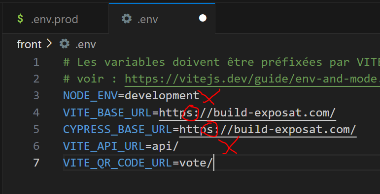
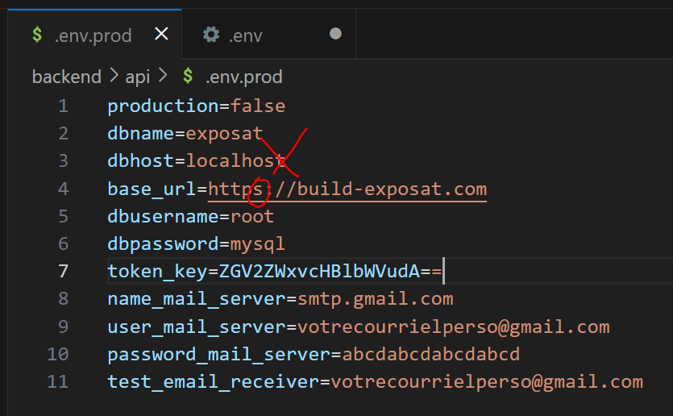

Dans ces exemples, le protocole `https` est utilisé alors que le serveur local ne supporte que `http`. Cela provoque l’erreur `net::ERR_CERT_AUTHORITY_INVALID`.
<br><br>

**Bon :**
Assurez-vous d’utiliser `http` dans vos variables d’environnement pour pointer vers votre serveur local ou de développement.

```env
VITE_BASE_URL=http://build-exposat.com/
CYPRESS_BASE_URL=http://build-exposat.com/
base_url=http://build-exposat.com
```

Après correction, enregistrez les fichiers, relancez la compilation du projet puis rechargez la page pour vérifier que l’erreur a disparu.
<br><br>

---

## Erreur "La communication avec le serveur a échoué" : CORS, ERR_FAILED

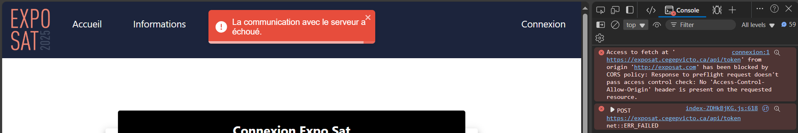

Cette erreur apparaît lorsque le frontend tente de communiquer avec une URL de production (par exemple `https://exposat.cegepvicto.ca`) alors que vous travaillez en local. Cela provoque un blocage CORS, car le serveur distant refuse les requêtes provenant de votre environnement local.

**Cause principale :**
Vous avez laissé l’URL du site web de production dans vos variables d’environnement (`.env`, `.env.prod`) au lieu d’utiliser l’URL locale (ex : `http://build-exposat.com`).
<br><br>

**Solution :**
- Ouvrez vos fichiers `.env` et `.env.prod` dans le dossier `front`.
- Remplacez toutes les occurrences de l’URL de production (`https://exposat.cegepvicto.ca`) par votre URL locale (par exemple `http://build-exposat.com`).
- Enregistrez les modifications, relancez la compilation du projet, puis rechargez la page.

Exemple :

```env
# Mauvais
VITE_BASE_URL=https://exposat.cegepvicto.ca/
# Bon
VITE_BASE_URL=http://build-exposat.com/
```

Après correction, l’erreur de CORS devrait disparaître et la communication avec le serveur local fonctionner normalement.
<br><br>

---

## Erreur "La communication avec le serveur a échoué" : CORS

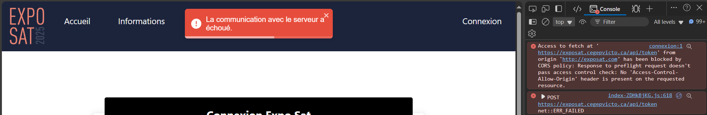

Cette erreur CORS survient lorsque l’URL de votre API n’est pas exactement la même que celle de votre frontend. Pour que la communication fonctionne, le nom de domaine (ou l’IP) doit être identique pour le frontend et le backend. Par exemple, `http://localhost` et `http://exposat.com` ne sont pas considérés comme identiques, même s’ils pointent tous deux vers localhost. De même, `http://exposat.quelquechose.com` et `http://exposat.com` sont différents.

**À noter :**  
Les ports différents ne posent pas de problème. Par exemple, `http://exposat.com:5173` (frontend) et `http://exposat.com` (backend) fonctionneront ensemble.

**Important :**  
N’essayez pas de contourner ou de forcer ce comportement CORS côté navigateur ou serveur. Il s’agit d’une règle de sécurité du web, et toute tentative de « bricolage » sera une perte de temps.
<br><br>

**Solution :**
- Assurez-vous que l’URL de votre API dans vos fichiers `.env` est exactement la même que celle utilisée pour accéder à votre frontend (hors port).
- Modifiez vos variables d’environnement si nécessaire, puis relancez votre projet.

Exemples de cas qui ne fonctionneront pas :
- `http://localhost` (API) et `http://exposat.com` (frontend)
- `http://exposat.quelquechose.com` (API) et `http://exposat.com` (frontend)

Exemple de cas qui fonctionne :
- `http://exposat.com:5173` (frontend) et `http://exposat.com` (API)

Après correction, rechargez la page pour vérifier que l’erreur a disparu.
<br><br>

---

## Erreur "La communication avec le serveur a échoué" : pas de log

Cette erreur se manifeste lorsque la communication avec le serveur échoue, mais qu’aucun message d’erreur n’apparaît dans la console du navigateur. Cela indique généralement un problème côté serveur.

**Causes possibles :**
- **La base de données `exposat` n’a pas été créée.**
- **Une erreur est présente dans le code de l’API backend.**
<br><br>

**Solution :**
1. Vérifiez que la base de données `exposat` existe bien dans votre environnement MySQL.
2. Consultez les logs du serveur backend (PHP, Apache, etc.) pour identifier d’éventuelles erreurs dans le code de l’API.
3. Corrigez toute erreur détectée, puis redémarrez le serveur si nécessaire.

Après correction, rechargez la page pour vérifier que la communication avec le serveur fonctionne correctement.
<br><br>

---

## Erreur "Votre connexion n'est pas privée / Erreur de confidentialité"

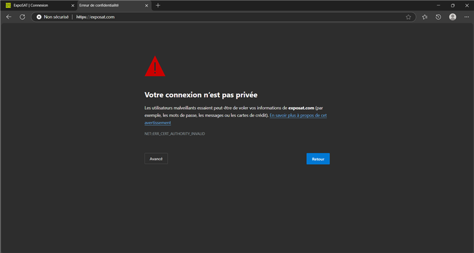

Cette erreur apparaît lorsque l’URL de votre site commence par `https://` au lieu de `http://`. Cela peut arriver si le navigateur ajoute automatiquement le protocole sécurisé HTTPS, même si votre serveur local ne le supporte pas.

**Cause principale :**
- L’URL saisie ou générée dans le navigateur commence par `https://` alors que votre environnement local fonctionne uniquement en HTTP.
<br><br>

**Solution :**
- Vérifiez l’URL dans la barre d’adresse de votre navigateur.
- Remplacez `https://` par `http://` puis rechargez la page.
- Si le navigateur continue de forcer le HTTPS, videz le cache ou essayez d’ouvrir le site dans une fenêtre de navigation privée.

Après correction, l’accès au site devrait fonctionner normalement en HTTP.
<br><br>

---

## Erreur "npm run start: Missing script "start""

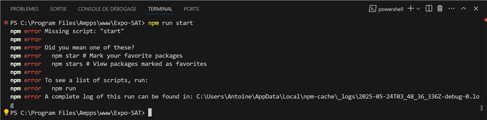

Cette erreur apparaît lorsque vous exécutez la commande `npm run start` dans un dossier qui ne contient pas de script `start` dans son fichier `package.json`. Cela se produit généralement si vous lancez la commande dans le mauvais dossier.

**Cause principale :**
- Vous avez exécuté `npm run start` dans le dossier racine `Expo-SAT` au lieu du dossier `front`.
<br><br>

**Solution :**
1. Ouvrez un terminal.
2. Naviguez dans le dossier `front` :
   ```powershell
   cd front
   ```
3. Exécutez à nouveau la commande :
   ```powershell
   npm run start
   ```

Après cela, le script devrait démarrer correctement si le fichier `package.json` du dossier `front` contient bien le script `start`.
<br><br>

---

## Erreur "npm install n'installe pas mes librairies"

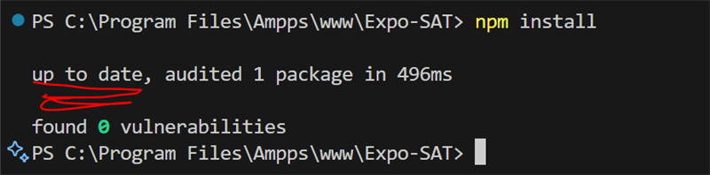

Cette situation se produit lorsque vous exécutez la commande `npm install` dans le mauvais dossier, par exemple à la racine du projet `Expo-SAT` au lieu du dossier `front`. Résultat : aucune dépendance frontend n’est installée, et le terminal affiche simplement "up to date".
<br><br>

**Solution :**
1. Ouvrez un terminal.
2. Naviguez dans le dossier `front` :
   ```powershell
   cd front
   ```
3. Exécutez la commande :
   ```powershell
   npm install
   ```

Les librairies nécessaires au frontend seront alors correctement installées dans le dossier `front`.
<br><br>

---

## Erreur "'tsc' n'est pas reconnu en tant que commande interne"

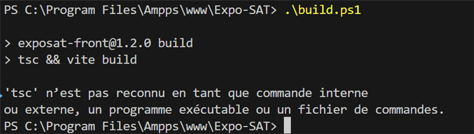

Cette erreur apparaît lorsque vous essayez de lancer la compilation (`build.ps1`) alors que les dépendances npm, dont TypeScript (`tsc`), ne sont pas installées dans le dossier `front`.

**Cause principale :**
- Vous avez oublié d’exécuter `npm install` dans le dossier `front` avant de lancer la commande de build. TypeScript et d’autres outils nécessaires ne sont donc pas disponibles.
<br><br>

**Solution :**
1. Ouvrez un terminal.
2. Rendez-vous dans le dossier `front` :
   ```powershell
   cd front
   ```
3. Installez les dépendances :
   ```powershell
   npm install
   ```
4. Revenez à la racine du projet si besoin, puis relancez la commande de build :
   ```powershell
   .\build.ps1
   ```

Après cela, la commande `tsc` devrait être reconnue et la compilation pourra s’effectuer correctement.
<br><br>

---

## Erreur "erreurs avec les librairies" (npm, dépendances, build, etc.)

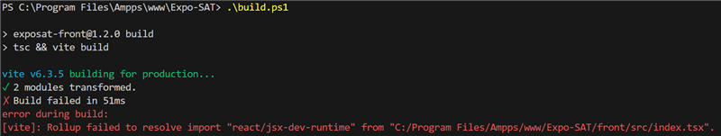

Il arrive que des erreurs apparaissent lors de l’installation ou du build à cause de problèmes de versions ou de dépendances mal synchronisées. Par exemple, après avoir changé la version d’une librairie (comme MUI), le code peut générer des erreurs même si le `package.json` indique la bonne version. Cela se produit souvent parce que le dossier `node_modules` contient encore l’ancienne version, mais npm pense que tout est à jour.

**Symptômes fréquents :**
- Erreurs lors du build (`vite`, `rollup`, etc.)
- Problèmes d’imports ou de modules introuvables
- Incohérences entre la version indiquée dans `package.json` et celle réellement utilisée
<br><br>

**Solution :**
Supprimez les dossiers/fichiers temporaires suivants :
- `Expo-SAT\front\package-lock.json`
- `Expo-SAT\front\node_modules`
- `Expo-SAT\front\dist`
- `Expo-SAT\backend\api\vendor`
- `Expo-SAT\build`

**Attention :**  
Ne supprimez pas `package.json` ni `composer.lock`, sinon le projet ne fonctionnera plus.

Ensuite, réinstallez les dépendances :

```powershell
cd front
npm install
```

Puis allez dans `backend/api` et faites :

```powershell
composer install
```

Enfin, relancez la compilation du projet. Les erreurs liées aux librairies devraient disparaître.
<br><br>

---

## Problèmes avec AMPPS

Si vous n’arrivez pas à démarrer le site avec la version la plus récente de PHP via AMPPS, il se peut que vous deviez utiliser une alternative. Après plusieurs tests, la seule alternative qui a fonctionné de façon fiable est **WAMP**. Notez que les configurations diffèrent légèrement entre AMPPS et WAMP.

**Recommandation :**  
La meilleure solution reste d’installer **PHP** et **MySQL** manuellement sur votre machine. Cela évite les bogues de débogueur, les limitations de PHP, les fonctionnalités payantes ou d’autres contraintes imposées par certains environnements tout-en-un. Il faudra cependant apprendre à configurer PHP et MySQL vous-même (de nombreux tutoriels sont disponibles sur YouTube). Ce n’est pas aussi « clé en main » qu’AMPPS, mais c’est la solution la plus stable à long terme.

**À essayer avant d’abandonner AMPPS :**  
Si vous avez seulement de petits problèmes avec AMPPS ou que celui-ci cesse de fonctionner, ne changez pas d’outil tout de suite. Désinstallez AMPPS complètement, puis réinstallez-le à partir de zéro. Cette opération règle la plupart des problèmes courants. En général, vous perdrez moins de temps à réinstaller AMPPS qu’à essayer de configurer un autre environnement.

En résumé :
- **Problème majeur avec AMPPS ?** Essayez WAMP ou une installation manuelle de PHP/MySQL.
- **Petit bogue ou AMPPS ne démarre plus ?** Désinstallez et réinstallez AMPPS, cela règle la majorité des soucis.
<br><br>

---

## Problème : Suppression impossible (équipes, juges, modèles de grille d’évaluation)

Il peut arriver que la suppression d’équipes, de juges ou de modèles de grille d’évaluation ne fonctionne pas, même si un message de succès s’affiche. Cela est généralement dû à des problèmes de **clés étrangères** dans la base de données.

**Explication :**  
Lorsque vous essayez de supprimer un élément (équipe, juge, modèle, etc.), la requête SQL peut échouer si cet élément est référencé ailleurs dans la base de données via une clé étrangère. Par exemple, si une équipe est liée à des résultats ou des évaluations, la suppression sera bloquée par la contrainte de clé étrangère.

**Problèmes connus :**
- La base de données comporte des relations mal conçues héritées des équipes précédentes.
- Certaines parties du site n’affichent pas correctement les erreurs SQL liées aux clés étrangères : vous pouvez recevoir un message de succès alors que la suppression a échoué.
<br><br>

**Solution :**
- Vérifiez dans la base de données si l’élément à supprimer est référencé dans d’autres tables (ex : une équipe liée à des résultats).
- Supprimez d’abord les éléments dépendants (ex : résultats, évaluations, etc.) avant de supprimer l’élément principal.
- Si possible, améliorez la gestion des erreurs côté backend pour afficher un message d’erreur clair en cas d’échec de suppression dû à une clé étrangère.

**À noter :**  
Ce problème nécessite parfois une correction manuelle dans la base de données ou une amélioration du code pour mieux gérer les contraintes d’intégrité référentielle.
<br><br>

---

## Problème : Impossible de créer un VirtualHost (AMPPS)

Si, lors de l’étape « Add an entry to Host File? » dans le panneau d’administration d’AMPPS, la case à cocher est grisée ou qu’une erreur apparaît lorsque vous cliquez sur « Add Domain », c’est qu’AMPPS n’a pas les permissions nécessaires pour modifier le fichier `hosts` de Windows.
<br><br>

### Procédure complète pour corriger ce problème et configurer AMPPS

1. **Changer les permissions du fichier `hosts` :**
    1. Naviguez vers le dossier `C:\Windows\System32\drivers\etc`.
    2. Clic droit sur le fichier `hosts`, Propriétés.
    3. Onglet `Sécurité`, bouton `Avancé`.
    4. Cliquez sur `Modifier` à côté de `Propriétaire`.
    5. Cliquez sur `Avancé`, puis sur `Rechercher`.
    6. Sélectionnez votre utilisateur, puis cliquez sur `OK` (plusieurs fois si nécessaire).
    7. Appliquez les changements et fermez les fenêtres.
    8. De retour dans les propriétés, onglet `Sécurité`, sélectionnez votre utilisateur, cliquez sur `Modifier`, puis cochez `Autoriser` pour `Contrôle total`. Validez et fermez.

2. **Ajouter les domaines dans AMPPS :**
    - Rendez-vous sur le panneau de configuration AMPPS : [http://localhost/ampps/index.php](http://localhost/ampps/index.php)
    - Cliquez sur `Add domain` et suivez ces étapes pour chaque domaine :

    **a. Version compilée du site**
    - Domain: `build-exposat.com`
    - Domain Type: `Addon`
    - Domain Path: `C:\Program Files\Ampps\www\Expo-SAT\build`
    - Add an SSL entry?: **ne cochez pas**
    - Add an entry to Host File?: **COCHEZ CETTE CASE**
    - Cliquez sur `Add Domain`

    **b. Version dev du site**
    - Domain: `dev-exposat.com`
    - Domain Type: `Addon`
    - Domain Path: `C:\Program Files\Ampps\www\Expo-SAT`
    - Add an SSL entry?: **ne cochez pas**
    - Add an entry to Host File?: **COCHEZ CETTE CASE**
    - Cliquez sur `Add Domain`

    **c. Accès à l'API (PHP)**
    - Domain: `php-exposat.com`
    - Domain Type: `Addon`
    - Domain Path: `C:\Program Files\Ampps\www\Expo-SAT\backend\api`
    - Add an SSL entry?: **ne cochez pas**
    - Add an entry to Host File?: **COCHEZ CETTE CASE**
    - Cliquez sur `Add Domain`

    **d. (Optionnel) Version personnelle**
    - Clonez le projet ailleurs, renommez-le (ex: `Perso-Expo-SAT`), déplacez-le dans `C:\Program Files\Ampps\www`, puis créez un domaine :
    - Domain: `perso-exposat.com`
    - Domain Type: `Addon`
    - Domain Path: `C:\Program Files\Ampps\www\Perso-Expo-SAT\build`
    - Add an SSL entry?: **ne cochez pas**
    - Add an entry to Host File?: **COCHEZ CETTE CASE**
    - Cliquez sur `Add Domain`

3. **Vérification du fichier hosts**
    - Votre fichier `C:\Windows\System32\drivers\etc\hosts` devrait contenir :
    ```
    127.0.0.1   build-exposat.com
    127.0.0.1   php-exposat.com
    127.0.0.1   dev-exposat.com
    ```

**Remarques importantes :**
- Il est préférable d’utiliser AMPPS avec les droits administrateur pour éviter ce type de problème.
- Modifier manuellement le fichier `hosts` peut dépanner, mais la procédure ci-dessus garantit une configuration correcte et durable.
- Si malgré tout cela ne fonctionne pas, envisagez d’utiliser un autre environnement comme WAMP ou une installation manuelle de PHP/MySQL.
<br><br>

---

## Où trouver les logs d’erreurs PHP et Apache ?

Pour diagnostiquer les erreurs serveur (par exemple, erreurs 500 ou problèmes backend), il est souvent utile de consulter les fichiers de logs.

### Emplacement des logs sous AMPPS

- **Logs Apache** :  
  Les logs du serveur web Apache (erreurs, accès, etc.) se trouvent ici :  
  ```
  C:\Program Files\Ampps\apache\logs
  ```
  Les fichiers principaux sont :
  - `error.log` : erreurs globales du serveur web (à consulter en priorité)
  - `access.log` : journal des accès HTTP
  - `build-exposat.com.err`, `dev-exposat.com.err`, etc. : logs d’erreurs spécifiques à chaque VirtualHost (domaine)

- **Logs PHP** :  
  Par défaut, sous AMPPS, les erreurs PHP sont généralement redirigées vers le log Apache (`error.log`) ou vers le fichier `.err` correspondant au VirtualHost utilisé (ex : `build-exposat.com.err`).  
  Par exemple, si vous utilisez la fonction PHP `error_log("Appel de la fonction");` dans votre code, le message apparaîtra dans le fichier `.err` du domaine concerné (ex : `build-exposat.com.err`).  
  Dans le fichier `php.ini`, la directive suivante contrôle le fichier de log PHP :
  ```
  ;error_log = php_errors.log
  ```
  Si cette ligne est commentée (avec un `;`), les erreurs PHP sont envoyées dans le log Apache ou dans le fichier `.err` du VirtualHost.
<br><br>

### Gestionnaire personnalisé de logs : LogHandler.php

Le projet inclut également un gestionnaire de logs personnalisé situé dans `backend/api/src/Handlers/LogHandler.php`.  
Ce fichier propose une classe `LogHandler` qui implémente l’interface PSR-3 `LoggerInterface` et permet de générer différents niveaux de logs (emergency, alert, critical, error, warning, notice, info, debug) dans des fichiers dédiés au format `backend/api/log/error-YYYY-MM-DD.log`.

**Exemple d’utilisation dans le code :**
```php
use App\Handlers\LogHandler;

$logger = new LogHandler();
$logger->error("Une erreur est survenue lors de la connexion à la base de données.", [
    "http_error_code" => 500
]);
```
Cela créera (ou complétera) un fichier de log dans `backend/api/log/` avec le message et le niveau d’erreur spécifié.

> **Remarque :**  
> Tous les membres de l’équipe n’utilisent pas forcément ce gestionnaire personnalisé pour le débogage. Certains utilisent directement les logs Apache, la fonction PHP `error_log()`, ou encore les outils de log du frontend (`console.log`). Choisissez la méthode la plus adaptée à votre besoin.

<br>

### Comment utiliser ces logs ?

1. **En cas d’erreur serveur (500, page blanche, etc.)** :  
   Ouvrez le fichier `error.log` ou le fichier `.err` correspondant à votre domaine dans le dossier ci-dessus et cherchez les dernières lignes pour identifier la cause de l’erreur.

2. **Pour les erreurs PHP ou les messages de debug** :  
   Les messages d’erreur PHP et les appels à `error_log()` s’y trouvent également, sauf si vous avez configuré un autre fichier de log dans `php.ini`.  
   Si vous utilisez le gestionnaire `LogHandler`, consultez les fichiers dans `backend/api/log/`.

3. **Astuce** :  
   Vous pouvez ouvrir ces fichiers avec un éditeur de texte (Notepad, VS Code, etc.).  
   Pensez à actualiser le fichier pour voir les nouvelles erreurs après chaque test.